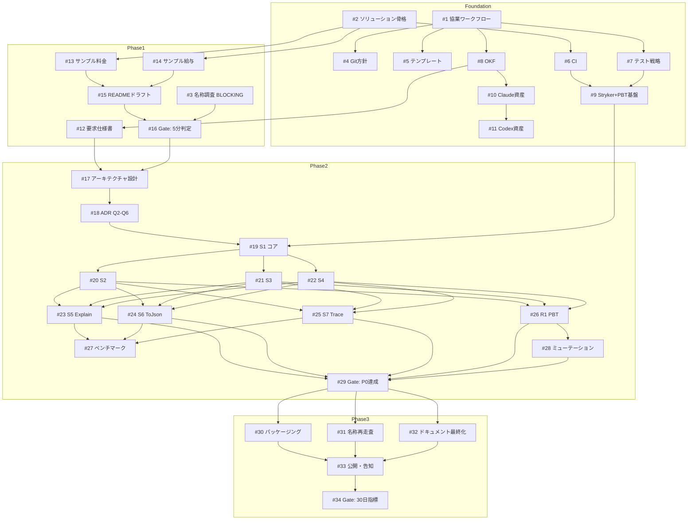

# Yurai プロジェクト実行計画

Yurai(Explainable domain calculations for .NET — 軽量 computation-lineage ライブラリ)の実行計画書。
提案書 Draft 1.0(Phase 0 完了・条件付きGo)に基づき、2026-08-08 に GitHub Issue #1〜#35 として起票した計画の正本ドキュメント。

- 親Issue(Epic): [#35 Yurai 実行計画: 全体像・依存グラフ・役割分担](https://github.com/urario/Yurai/issues/35)
- 日々の作業状態は各 Issue とラベルで管理し、本書は全体像・依存関係・体制ルールの参照用とする。

## 体制

| アクター | 役割 |
|---|---|
| **Human** | 設計判断・優先度・受け入れ・ゲートclose(選択肢と推奨の提示はAIに任せる) |
| **Claude Code**(Opus 5 / Sonnet 5) | 要求整理・アーキテクチャ・設計・レビュー・ナレッジ管理 |
| **Codex**(GPT5.6 Sol / Luna) | テスト先行の実装・検証・PR準備 |

- Claude と Codex は直接会話せず、**GitHub(Issue / PR / レビューコメント)を介して情報共有**する。
- **PR が品質ゲートキーパー**。main への直コミット・直push禁止(#4)。
- 言語ポリシー: Issue=日本語基本(外部貢献者は英語可)/ PR=日本語基本・英語可(テンプレートは日英両方 #5)/ ソースコード・コメント・README・公開ドキュメント=英語。

## フェーズ構成と Issue 一覧

### 基盤: 開発環境・ガバナンス(Phase 1 と並行で最優先)

| Issue | 内容 | 担当 | 依存 |
|---|---|---|---|
| [#1](https://github.com/urario/Yurai/issues/1) | AI協業ワークフローと言語ポリシー(CLAUDE.md / AGENTS.md / CONTRIBUTING) | Claude→Human承認 | なし |
| [#4](https://github.com/urario/Yurai/issues/4) | Git運用ポリシーとブランチ保護 | Claude起案+Human設定 | #1 |
| [#5](https://github.com/urario/Yurai/issues/5) | Issue・PRテンプレート整備(日英両言語) | Codex | #1 |
| [#2](https://github.com/urario/Yurai/issues/2) | .NETソリューション骨格(netstandard2.0・依存0) | Codex | なし |
| [#6](https://github.com/urario/Yurai/issues/6) | CI構築(build / test / format) | Codex | #2 |
| [#7](https://github.com/urario/Yurai/issues/7) | テスト戦略・品質ゲート規約(TDD / PBT / ミューテーション) | Claude→Human承認 | #1 |
| [#9](https://github.com/urario/Yurai/issues/9) | Stryker.NET+PBT基盤の導入とCI組込 | Codex | #6, #7 |
| [#8](https://github.com/urario/Yurai/issues/8) | OKF軽量ナレッジ管理ブートストラップ | Claude | #1 |
| [#10](https://github.com/urario/Yurai/issues/10) | Claude Code用 agents / skills | Claude | #1, #8 |
| [#11](https://github.com/urario/Yurai/issues/11) | Codex用 skills / AGENTS.md | Codex | #1, #10 |

### Phase 1: 名称検証とポジショニング

| Issue | 内容 | 担当 | 依存 |
|---|---|---|---|
| [#3](https://github.com/urario/Yurai/issues/3) | **Q1': "Yurai" 名称衝突調査【ブロッキング】** | Claude調査→Human判断 | なし(最優先) |
| [#12](https://github.com/urario/Yurai/issues/12) | 要求仕様書の作成(提案書 → RQ-xxx) | Claude→Human承認 | #1, #8 |
| [#13](https://github.com/urario/Yurai/issues/13) | ドメインサンプル① 料金計算 | Codex | #2 |
| [#14](https://github.com/urario/Yurai/issues/14) | ドメインサンプル② 給与計算 | Codex | #2(#13と並列可) |
| [#15](https://github.com/urario/Yurai/issues/15) | READMEドラフト(コードより先、Related Work 含む) | Claude→Human | #13, #14 |
| [#16](https://github.com/urario/Yurai/issues/16) | **Gate: Phase 1「5分で価値が分かる」判定** | Human | #15, #3 |

### Phase 2: MVP実装

| Issue | 内容 | 担当 | 依存 |
|---|---|---|---|
| [#17](https://github.com/urario/Yurai/issues/17) | アーキテクチャ設計とADR(DAG / Traced\<decimal\> / スレッド安全性) | Claude→Human承認 | #12, #16 |
| [#18](https://github.com/urario/Yurai/issues/18) | **ADR: Open Questions Q2〜Q6 の設計判断** | Claude提案→Human決定 | #17 |
| [#19](https://github.com/urario/Yurai/issues/19) | 実装S1: DAGノード+Of / As / Value+四則演算(TDD) | Codex | #17, #18, #9 |
| [#20](https://github.com/urario/Yurai/issues/20) | 実装S2: decimal混在演算+Min / Max | Codex | #19(S3/S4と並列可) |
| [#21](https://github.com/urario/Yurai/issues/21) | 実装S3: Round(digits, reason) | Codex | #19(S2/S4と並列可) |
| [#22](https://github.com/urario/Yurai/issues/22) | 実装S4: Yurai.If 分岐記録(R5) | Codex | #19(S2/S3と並列可) |
| [#23](https://github.com/urario/Yurai/issues/23) | 実装S5: Explain() テキスト出力(R2) | Codex | #20〜#22(S6/S7と並列可) |
| [#24](https://github.com/urario/Yurai/issues/24) | 実装S6: ToJson()+スキーマ文書化 | Codex | #20〜#22(S5/S7と並列可) |
| [#25](https://github.com/urario/Yurai/issues/25) | 実装S7: DependsOn / Trace / Inputs(R3) | Codex | #20〜#22(S5/S6と並列可) |
| [#26](https://github.com/urario/Yurai/issues/26) | R1検証: PBTによるdecimal完全互換 | Codex | #19〜#22 |
| [#28](https://github.com/urario/Yurai/issues/28) | ミューテーションテスト・ベースライン | Codex | #23〜#26 |
| [#27](https://github.com/urario/Yurai/issues/27) | ベンチマーク・メモリ計測(ノード1万超) | Codex | #23〜#25 |
| [#29](https://github.com/urario/Yurai/issues/29) | **Gate: P0要件(R1〜R6)達成確認** | Claude review→Human close | #23〜#26, #28 |

### Phase 3: NuGet公開・告知

| Issue | 内容 | 担当 | 依存 |
|---|---|---|---|
| [#30](https://github.com/urario/Yurai/issues/30) | NuGetパッケージング+リリースCI | Codex | #29 |
| [#31](https://github.com/urario/Yurai/issues/31) | v1.0告知前の名称・キーワード再走査 | Claude | #29(#30のpublish前に完了必須) |
| [#32](https://github.com/urario/Yurai/issues/32) | README・ドキュメント最終化+ガイド | Claude→Human | #29, #31 |
| [#33](https://github.com/urario/Yurai/issues/33) | 公開・告知とフィードバック収集体制 | Human+Claude | #30〜#32 |
| [#34](https://github.com/urario/Yurai/issues/34) | **Gate: 30日指標レビューと継続判断** | Human | #33 の30日後 |

## 依存グラフ

## ラベル体系

| 種類 | ラベル |
|---|---|
| フェーズ | `phase:0-foundation` `phase:1-positioning` `phase:2-mvp` `phase:3-release` |
| 次アクション担当 | `owner:human` `owner:claude` `owner:codex`(「今の次アクションを取る主体」。進行に応じて付け替える) |
| 種別 | `type:governance` `type:env` `type:research` `type:design` `type:impl` `type:test` `type:docs` `type:release` |
| 特殊 | `gate`(Human の明示的 close が必要な節目) `blocking`(下流を止める) `epic` |

Milestone / GitHub Project は使わず、ラベル+Epic のチェックリストで進捗を管理する(決定事項)。

## 運用ルール

- **#3(名称衝突調査)が最優先ブロッカー**。決着まで Phase 2 実装に着手しない。基盤・Phase 1 は名称仮置きで並行可。
- プロセスは Surveyor リポジトリの運用資産を **OSSライブラリ規模に軽量化** して移植する(RQ-ID・OKF・TDD/ミューテーション・PR品質ゲートは維持、フルの成果物ID体系は採用しない)。
- **永続的な判断は `knowledge/` に置く**(#8 で構成確立)。Issue=作業状態 / PR=変更差分と検証 / `knowledge/`=Issue と PR を越えて残る要求・判断・規約、という三分割。`knowledge/` は [OKF(Open Knowledge Format)v0.2](https://github.com/GoogleCloudPlatform/knowledge-catalog/blob/main/okf/SPEC.md) 準拠のバンドルとして維持する(判断は ADR-0003)。規約は [`knowledge/process/knowledge-policy.md`](../knowledge/process/knowledge-policy.md)、RQ-ID 運用は [`knowledge/process/traceability.md`](../knowledge/process/traceability.md)。
- 提案書の制約(新規性主張の上限 §6.4 / 禁止文言 §9.2 / 非目標 §7.2)の正本は #12 の要求仕様書
  ([knowledge/requirements/registry.md](../knowledge/requirements/registry.md) の RQ-024・RQ-025・RQ-016〜023)
  に転記済み。個々の禁止語をこの計画書に再掲しない — 複製は正本と食い違う。
- 完了条件: 全子Issueが close され、#34 で継続判断が記録されていること。

## 手動作業(Human)

- main の branch protection 設定(#4)
- NuGet アカウント・API キー準備と publish 実行(#30, #33)
- 各 `gate` Issue の判定と close(#16, #18, #29, #34)
