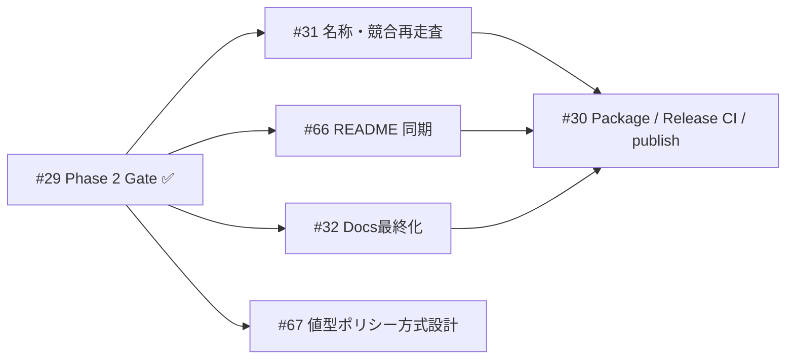
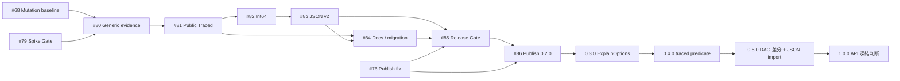

# Yurai プロジェクト実行計画

Yurai(Explainable domain calculations for .NET — 軽量 computation-lineage ライブラリ)の実行計画書。
全体像・依存関係・体制ルールの参照用の正本ドキュメントであり、日々の作業状態は各 Issue とラベルで管理する。

- 親Issue(Epic): [#35 Yurai 実行計画: 全体像・依存グラフ・役割分担](https://github.com/urario/Yurai/issues/35)
- **現在地(2026-08-13 JST): 0.1.0 公開完了。0.2.0 は実装着手直前。**

2026-08-10 の計画見直しで、本書はフェーズの列挙から**リリース列**に組み替えた。Phase 3 の
先が存在しなかった状態を解消し、0.2.0 以降を明示している。

## 体制

| アクター | 役割 |
|---|---|
| **Human** | 設計判断・優先度・受け入れ・ゲートclose(選択肢と推奨の提示はAIに任せる) |
| **Claude Code**(Opus 5 / Sonnet 5) | 要求整理・アーキテクチャ・設計・レビュー・ナレッジ管理 |
| **Codex**(GPT5.6 Sol / Luna) | テスト先行の実装・検証・PR準備 |

- Claude と Codex は直接会話せず、**GitHub(Issue / PR / レビューコメント)を介して情報共有**する。
- **PR が品質ゲートキーパー**。main への直コミット・直push禁止(#4)。
- 言語ポリシー: Issue=日本語基本(外部貢献者は英語可)/ PR=日本語基本・英語可(テンプレートは日英両方 #5)/ ソースコード・コメント・README・公開ドキュメント=英語。

## 完了済みフェーズ

依存関係は既に解決済みのため再掲しない。結果だけを残す。

### 基盤: 開発環境・ガバナンス(10/10 完了)

| Issue | 結果 |
|---|---|
| [#1](https://github.com/urario/Yurai/issues/1) | AI協業ワークフローと言語ポリシー — `AGENTS.md` / `CLAUDE.md` / `CONTRIBUTING.md` |
| [#2](https://github.com/urario/Yurai/issues/2) | .NETソリューション骨格 — `netstandard2.0`、依存0は `Directory.Build.targets` で機械的に強制 |
| [#4](https://github.com/urario/Yurai/issues/4) | Git運用ポリシー — [`knowledge/process/git-policy.md`](../knowledge/process/git-policy.md) |
| [#5](https://github.com/urario/Yurai/issues/5) | Issue・PRテンプレート(日英) |
| [#6](https://github.com/urario/Yurai/issues/6) | CI — `.github/workflows/ci.yml`(build / test / format + OKF 整合性検査) |
| [#7](https://github.com/urario/Yurai/issues/7) | テスト戦略・品質ゲート規約 — [`knowledge/process/testing-and-quality.md`](../knowledge/process/testing-and-quality.md) |
| [#8](https://github.com/urario/Yurai/issues/8) | OKF軽量ナレッジ管理 — [`knowledge/`](../knowledge/index.md) |
| [#9](https://github.com/urario/Yurai/issues/9) | Stryker.NET + CsCheck(ADR-0005)、deep レーン `.github/workflows/deep.yml` |
| [#10](https://github.com/urario/Yurai/issues/10) | Claude Code用 agents / skills — `.claude/` |
| [#11](https://github.com/urario/Yurai/issues/11) | Codex用 skills — `.codex/` |

### Phase 1: 名称検証とポジショニング(6/6 完了)

| Issue | 結果 |
|---|---|
| [#3](https://github.com/urario/Yurai/issues/3) | 名称衝突調査 — **Yurai を継続**。ブロッカー解消 |
| [#12](https://github.com/urario/Yurai/issues/12) | 要求仕様書 — [`knowledge/requirements/registry.md`](../knowledge/requirements/registry.md)(RQ-001〜RQ-029) |
| [#13](https://github.com/urario/Yurai/issues/13) | ドメインサンプル① 料金計算 — `samples/Pricing/` |
| [#14](https://github.com/urario/Yurai/issues/14) | ドメインサンプル② 給与計算 — `samples/Payroll/` |
| [#15](https://github.com/urario/Yurai/issues/15) | READMEドラフト(Related Work 含む) |
| [#16](https://github.com/urario/Yurai/issues/16) | **Gate: 「5分で価値が分かる」判定** — 通過 |

### Phase 2: MVP実装(13/13 完了)

| Issue | 結果 |
|---|---|
| [#17](https://github.com/urario/Yurai/issues/17) | アーキテクチャ設計 — [`knowledge/design/core-architecture.md`](../knowledge/design/core-architecture.md)、ADR-0006〜0008 |
| [#18](https://github.com/urario/Yurai/issues/18) | Open Questions Q2〜Q6 の設計判断 — ADR-0009〜0016 |
| [#19](https://github.com/urario/Yurai/issues/19) | S1: 不変 evidence DAG + `Traced.Of` / `.As` / `.Value` + 四則演算 |
| [#20](https://github.com/urario/Yurai/issues/20) | S2: プレーン値との混在演算(明示オーバーロード)+ `Min` / `Max` |
| [#21](https://github.com/urario/Yurai/issues/21) | S3: `Round(digits, reason)` |
| [#22](https://github.com/urario/Yurai/issues/22) | S4: `Traced.If` — 実行された分岐の記録 |
| [#23](https://github.com/urario/Yurai/issues/23) | S5: `Explain()` テキスト出力 |
| [#24](https://github.com/urario/Yurai/issues/24) | S6: `ToJson()` + [`docs/json-schema-v1.md`](json-schema-v1.md) |
| [#25](https://github.com/urario/Yurai/issues/25) | S7: `DependsOn` / `Trace` / `Inputs` |
| [#26](https://github.com/urario/Yurai/issues/26) | RQ-001 検証 — CsCheck によるプロパティベーステスト |
| [#27](https://github.com/urario/Yurai/issues/27) | ベンチマーク・メモリ計測 — [`docs/performance.md`](performance.md) |
| [#28](https://github.com/urario/Yurai/issues/28) | ミューテーションテスト・ベースライン(これを根拠に `break` 閾値を 90 に設定) |
| [#29](https://github.com/urario/Yurai/issues/29) | **Gate: P0要件達成確認** — 通過 |

到達点: 公開 API は `readonly struct Traced` ただ1つ。生成(`Of` / `Min` / `Max` / `If`)も
その静的メンバとして載る。`netstandard2.0`、実行時依存0。

> 当初は静的クラス `Yurai` が生成の入口だったが、名前空間 `Yurai` と衝突して外部から
> 呼べないことが #66 で判明し、ADR-0017 で `Traced` に畳んだ。

## リリース列

Phase 3 以降はフェーズ番号ではなくリリース番号で追う。

| リリース | 内容 | 状態 |
|---|---|---|
| **0.1.0** | NuGet 初版 | ✅ 完了 |
| **0.2.0** | closed `Traced<T>` + Int64 + JSON schema v2 | 実行準備完了 |
| 0.3.0 | ExplainOptions(深さ制限・カルチャ・出力形式)— RQ-026 | 未着手 |
| 0.4.0 | traced predicate(条件の系譜) | 未着手 |
| 0.5.0 | DAG 差分比較 + JSON import | 未着手 |
| 1.0.0 | 公開 API 凍結の判断 | 未定 |

### 0.1.0: NuGet 初版(Phase 3・完了)

| Issue | 結果 |
|---|---|
| [#66](https://github.com/urario/Yurai/issues/66) | README と実装を同期 |
| [#31](https://github.com/urario/Yurai/issues/31) | NuGet 名称・キーワード再走査を完了 |
| [#32](https://github.com/urario/Yurai/issues/32) | README・公開ドキュメント・利用判断ガイドを最終化 |
| [#30](https://github.com/urario/Yurai/issues/30) | パッケージング、リリースCI、0.1.0 publish を完了 |
| [#67](https://github.com/urario/Yurai/issues/67) | 0.2.0 の方式設計を完了。ADR-0018 と関連文書を `stable` 化 |

Yurai 0.1.0 は [NuGet.org](https://www.nuget.org/packages/Yurai) に公開済み。公開 API を
1.0.0 まで凍結しない SemVer 0.x として出荷し、0.2.0 では ADR-0018 に従って
`Traced` から `Traced<T>` への破壊的変更を行う。

### 0.2.0: 第2の値型

`decimal` 以外の値型を導入する。**需要待ちではなく、初版直後の次マイルストーンとして日程に固定**
した(maintainer 判断)。#67 の設計調査と architecture review により、0.2.0 の supported set は
**`decimal + System.Int64(long)`** に確定した。浮動小数点とユーザー定義値オブジェクトは、同じ
policy で安全に一般化できないため後続 ADR へ延期する。

公開 carrier は `Traced<T>`、non-generic `Traced` は carrier ではなく型推論用 static companion
とする。decimal は `Traced.Of(...)` の綴りを維持し、Int64 は既存呼び出しの意味を変えない
`Traced.OfInt64(...)` から明示的に導入する。public generic factory、public policy/profile、mutable
registry、consumer registration は導入しない。

実装は **`netstandard2.0` 単一ターゲット + closed type ごとの immutable internal binding**。
多ターゲット化も `INumber<T>` も採らず、runtime dependency 0 を維持する。evidence は
homogeneous `EvidenceNode<T>` DAG とし、heterogeneous graph や `object Value` は導入しない。
generic JSON export は schema v2、schema v1 は凍結し、decimal の v1 emitter だけを 0.2.x の
migration bridge として残す。

設計は #67 と ADR-0018 で完了済み。production implementation を始める前に #68 と #79 を
両方完了させる。#76 は独立したリリースパイプライン修正として並行できる。

| 順序 | Issue | 内容 | 担当 | 状態・依存 |
|---|---|---|---|---|
| 0A | [#68](https://github.com/urario/Yurai/issues/68) | 生存ミュータントの棚卸しと移行前ベースライン | Codex → Claude | Ready。#80 より前 |
| 0B | [#79](https://github.com/urario/Yurai/issues/79) | generic operator・dispatch・boxing・allocation スパイク / Go-NoGo | Codex → Claude → Human | Ready。#68 と並行可 |
| 0C | [#76](https://github.com/urario/Yurai/issues/76) | `.snupkg` 二重 push の修正 | Codex | Ready。実地受入は #86 |
| S8 | [#80](https://github.com/urario/Yurai/issues/80) | generic evidence 基盤と decimal regression 保護 | Codex → Claude | #68 + #79 Go |
| S9 | [#81](https://github.com/urario/Yurai/issues/81) | public `Traced<T>` + static `Traced` への移行 | Codex → Claude | #80 |
| S10 | [#82](https://github.com/urario/Yurai/issues/82) | Int64 fidelity と property tests | Codex → Claude | #81 |
| S11 | [#83](https://github.com/urario/Yurai/issues/83) | JSON schema v2 + decimal v1 bridge | Codex → Claude | #82 |
| S12 | [#84](https://github.com/urario/Yurai/issues/84) | 移行ガイド・README・XML docs・release notes | Claude → Codex | #81 後にdraft、#83 後に最終化 |
| Gate | [#85](https://github.com/urario/Yurai/issues/85) | 0.2.0 Release Readiness | Claude → Codex → Human | #68・#79・#80〜#84・#76修正 |
| Release | [#86](https://github.com/urario/Yurai/issues/86) | NuGet publish・symbols実地検証 | Human | #85 close + #76修正merged |

production code の主スライスは同時に1本とし、基本順序を
`#80 → #81 → #82 → #83` とする。#84 のdraftと #76 は、同じproduction filesを競合編集しない
範囲で並行可能。

`break` 閾値は **90 に設定済み**(`low` 90 / `high` 95)。実測ベースラインは main HEAD
`7ca744b` の deep レーン実行。0.2.0 の移行はノード階層・フォーマッタ・JSON・依存クエリ・
テスト全域に及ぶため、閾値が立っていない状態で全域リファクタに入ると、テスト強度が下がっても
気づけない — それを避けるために公開前に設定した。#68 には、その計測で生存していた
ミュータントの棚卸しだけが残っている。

この決定は **ADR-0009**(多型ターゲティングの延期)、**ADR-0016**(carrier を非ジェネリックな
`Traced` と命名)、**ADR-0017**(生成メソッドを carrier に置く)を supersede する。ただし
ADR-0017 の namespace-name collision を再導入しない原則は維持する。**ADR-0014** の decimal
schema v1 は変更せず、型中立な export は JSON schema v2 として追加する。**RQ-023** は 0.1.x
の decimal-only boundとして同期する。**RQ-028** は長期的な型拡張の選択肢を記録する P2 のまま
維持し、Int64 を 0.2.0 の必須範囲にする根拠は ADR-0018 と本リリース計画が持つ。

ライブラリ側に decimal の別名型は追加しない。移行ガイドでは必要に応じて利用者側の
`using Money = Yurai.Traced<decimal>;` を案内する。`var` を使う既存例は概ね維持できる一方、
明示的な `Traced` 型注釈、フィールド / プロパティ、`Func<Traced>`、型引数は
`Traced<decimal>` へ変更が必要で、CS0723 / CS0718 と移行方法の対応を記載する。

### 0.3.0 以降

順序の根拠: **ジェネリック化の前に足した機能は、すべてジェネリックで書き直しになる。**
機能を先に入れるほど二重コストが増えるため、0.2.0 を先に通し、以降を新しい基盤の上に1回だけ書く。

| リリース | 内容 | 出典 |
|---|---|---|
| 0.3.0 | ExplainOptions — 深さ制限、カルチャ、出力形式 | RQ-026(P1)。8,192葉で `Explain()` が 6.9MB / `ToJson()` が 11.5MB という実測(`docs/performance.md`)があり、深さ制限がないのは実害のある足元の穴 |
| 0.4.0 | traced predicate(条件の系譜) | ADR-0011 が「将来の別 capability として提案され得る」と明示的に残した領域。現在は `Traced.If` の条件に使った値が依存クエリに現れない |
| 0.5.0 | DAG 差分比較 + JSON import | 「先月と今月で何が変わったか」に答える。前提として JSON 逆シリアライズが必要(RQ-013 は現在 export のみ) |
| 1.0.0 | 公開 API 凍結の判断 | — |

## バックログ

リリースに紐付かない既知の負債。優先度は低いが実在する。

- **`samples/Pricing` / `samples/Payroll` が Markdown のみでコンパイルされない。** 出力自体は
  `tests/Yurai.Tests/TracedExplainTests.cs` が固定しているため壊れてはいないが、実行可能な
  プロジェクトにはなっていない。
- 安定した外部ノードID(ADR-0006 は document-local に限定)。
- テキスト・クエリ結果のキャッシュ(`core-architecture.md` §4.6 — #27 が反復コストを示すまで導入しない)。
- xUnit v3 移行(プロパティライブラリ・Stryker.NET・ランナーの対応待ち)。
- ベンチマーク回帰閾値(安定したランナーでの反復計測が前提)。
- 提案書 Draft 1.0 のリポジトリ収容(`knowledge/requirements/registry.md` の "The proposal" 節)。

## 依存グラフ

GitHub Mermaid の互換性を優先し、複数ノードを `&` で束ねる構文は使用しない。

### 0.1.0

### 0.2.0 以降

## ラベル体系

| 種類 | ラベル |
|---|---|
| フェーズ | `phase:0-foundation` `phase:1-positioning` `phase:2-mvp` `phase:3-release` `phase:4-value-types` |
| 次アクション担当 | `owner:human` `owner:claude` `owner:codex`(「今の次アクションを取る主体」。進行に応じて付け替える) |
| 種別 | `type:governance` `type:env` `type:research` `type:design` `type:impl` `type:test` `type:docs` `type:release` |
| 特殊 | `gate`(Human の明示的 close が必要な節目) `blocking`(下流を止める) `epic` |

Milestone / GitHub Project は使わず、ラベル+Epic のチェックリストで進捗を管理する(決定事項)。

## 運用ルール

- プロセスは Surveyor リポジトリの運用資産を **OSSライブラリ規模に軽量化** して移植している(RQ-ID・OKF・TDD/ミューテーション・PR品質ゲートは維持、フルの成果物ID体系は採用しない)。
- **永続的な判断は `knowledge/` に置く**。Issue=作業状態 / PR=変更差分と検証 / `knowledge/`=Issue と PR を越えて残る要求・判断・規約、という三分割。`knowledge/` は [OKF(Open Knowledge Format)v0.2](https://github.com/GoogleCloudPlatform/knowledge-catalog/blob/main/okf/SPEC.md) 準拠のバンドルとして維持する(判断は ADR-0003)。規約は [`knowledge/process/knowledge-policy.md`](../knowledge/process/knowledge-policy.md)、RQ-ID 運用は [`knowledge/process/traceability.md`](../knowledge/process/traceability.md)。
- 提案書の制約(新規性主張の上限 / 禁止文言 / 非目標)の正本は要求仕様書
  ([knowledge/requirements/registry.md](../knowledge/requirements/registry.md) の RQ-024・RQ-025・RQ-016〜023)。
  個々の禁止語をこの計画書に再掲しない — 複製は正本と食い違う。
- 対外的な告知・指標管理は本リポジトリの Issue では扱わない(#33 / #34 を close した際の判断)。

## 手動作業(Human)

- main の branch protection 設定(#4)
- 各 `gate` Issue の判定と close
- #79 のスパイク結果が No-Go の場合の予約判断
- #85 通過後の 0.2.0 publish と、#86 の NuGet package / symbols 実地確認

## 0.2.0 完了条件

- #68 と #79 が完了し、production implementation の Go 条件を満たす
- #76 のworkflow修正、#80〜#84の実装・文書変更がマージ済み
- #85をHumanが承認してclose
- #86で `v0.2.0`、NuGet package、symbolsの公開を確認
- #76の実地受入を完了しclose
- 本書とEpic #35を0.3.0の現在地へ更新

## 完了条件

各リリースについて、そのリリースを構成する Issue が close され、次のリリースの範囲が
本書とEpic #35 に記録されていること。
