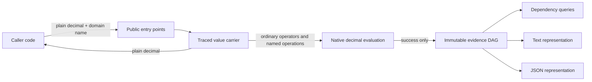

# Yurai core architecture

This document is the implementation-facing architecture for Yurai's decimal MVP. It
derives the core shape from the requirements, records the boundaries that all slices
share, and identifies decisions that still require maintainer approval before the
affected slice can be implemented. It does not make the undecided public API choices
owned by [issue #18](https://github.com/urario/Yurai/issues/18).

## 1. Architecture drivers

Yurai attaches queryable derivation evidence to eagerly evaluated domain values. The
value remains the result of ordinary C# arithmetic; Yurai adds evidence and never
substitutes its own numeric interpretation.

| Driver | Architectural response |
| --- | --- |
| Value fidelity (RQ-001) | Perform the native `decimal` operation before constructing evidence; propagate native failures without producing a result. |
| Explainability and queryability (RQ-002, RQ-003, RQ-012, RQ-014) | Preserve named inputs, named results, operation metadata, selected branches, and shared dependency structure in a traversable model. |
| Deployment reach (RQ-004) | Keep `src/Yurai` on `netstandard2.0`, BCL-only, with no runtime package dependency. |
| Immutable shared evidence (RQ-011) | Use an immutable DAG in which a new operation creates a parent and reuses existing children. |
| Familiar C# usage (RQ-008, RQ-009) | Keep arithmetic eager and operator-based inside an explicitly traced region; unwrap to a plain value at its boundary. |
| Minimal, coherent API (RQ-015) | Keep node and traversal types internal, map every public operation to user value, and prefer explicit boundaries over count-driven compression. |
| Decimal MVP without redefining the product (RQ-023, RQ-028, RQ-029) | Ship only `decimal`, use type-neutral concepts and private names where they cost nothing, and avoid a generic-math framework before another value type is approved. |
| Large and deep graphs | Use structural sharing and iterative traversals; measure, rather than guess, allocation and throughput in issue #27. |

The permanent non-goals are architectural boundaries: no symbolic evaluation, automatic
differentiation, sensitivity calculation, attribution, whole-program data-flow
tracking, evidence storage, rich rendering, or string-expression evaluation
(RQ-016 through RQ-022). The computation a developer explicitly places inside a traced
region is the complete scope of Yurai's evidence.

## 2. Vocabulary and semantic boundary

- A **value** is the already evaluated domain result. In the MVP it is a `decimal`.
- **Derivation evidence** records the operations and named decisions that produced a
  value. It is not an expression awaiting evaluation.
- A **dependency** exists when an evidence path from the result reaches an input.
- A **derivation** is the recorded sequence of operations and decisions along those
  paths.
- A **trace** is a dependency path. It is not an execution log and carries no
  sensitivity or apportionment meaning (RQ-003).
- A **traced region** begins when a plain value is introduced through the public entry
  point and ends when the caller reads the plain value. Evidence does not follow that
  plain value through code outside the region (RQ-019).

The value and its evidence are related by one invariant: the root evidence node stores
the exact value exposed by the carrier. There is no separately mutable value field that
can diverge from the root.

For arithmetic and Min/Max, dependencies are the recorded operand values consumed by
the operation, including both compared Min/Max operands. A branch condition is different
in the current API sketch: reading `.Value` and evaluating a comparison produces an
ordinary `bool` outside the evidence graph. An input used only by that condition is
therefore not discoverable as a dependency unless Yurai introduces traced predicates.
Q13 makes that absence the documented v1 boundary; any traced-predicate expansion is a
separate future public capability.

## 3. Architecture viewpoints

### 3.1 Context and responsibility view

| Component | Responsibility | Explicitly does not own |
| --- | --- | --- |
| Public entry points | Introduce plain values and express operations in ordinary C# syntax. | Evidence storage, global configuration, or expression parsing. |
| Traced value carrier | Hold one root reference and expose the root's evaluated value. | Mutable state, caches, or public node access. |
| Native operation boundary | Invoke the corresponding `decimal` operation with the same operands and parameters. | Alternate rounding, overflow, ordering, or exception rules. |
| Evidence nodes | Preserve evaluated values, operation metadata, and child references. | Text/JSON formatting and dependency-query result shapes. |
| Traversal kernel | Walk a DAG iteratively with reference-identity tracking and deterministic child order. | User-facing formatting policy. |
| Query, text, and JSON adapters | Interpret one immutable model for a specific output. | Mutation or re-evaluation of the calculation. |

### 3.2 Information view

The internal model is an abstract `EvidenceNode` with an evaluated `decimal` value and
a closed family of sealed node kinds. Names are conceptual here; private implementation
names may differ without changing the contract.

| Node kind | Required data | Children |
| --- | --- | --- |
| `Input` | Evaluated value and optional developer-supplied name. | None. |
| `BinaryOperation` | Evaluated value and operation kind. Min/Max also preserve which operand was selected so equal operands remain distinguishable. | Left and right, in source order. |
| `Round` | Evaluated value, digits, `MidpointRounding.ToEven`, and reason. | The unrounded value. |
| `Branch` | Evaluated value, decision name, condition outcome, selected branch label. | The selected result only; a plain condition creates no evidence edge. |
| `Named` | Evaluated value and developer-supplied result name. | The value being named. |

Fixed child fields are preferred over an array per node. They express arity, prevent an
extra allocation for common operations, and make malformed graphs harder to construct.
Constructors reject null children internally. A parent can only receive already
constructed children, all fields are read-only, and no rewiring operation exists;
cycles are therefore impossible through supported construction.

Naming an intermediate creates a `Named` parent rather than editing the child. Reusing
the same intermediate in two expressions gives both parents the same child reference.
For *n* successful input/naming/operation calls, the number of nodes is at most linear
in *n* even when the number of root-to-input paths is much larger (RQ-011).

### 3.3 Computation and data-flow view

For a binary operation:

1. Read the already evaluated values from the two roots.
2. Execute the corresponding native `decimal` operator with the same operands and
   parameters.
3. If native evaluation throws, propagate that exception type and construct no result
   node. Existing operands remain valid and unchanged.
4. If it succeeds, create one `BinaryOperation` node containing the exact result and
   references to the existing roots.
5. Return a new carrier holding only that parent reference.

Mixed operations first introduce the plain operand as an anonymous `Input` and then use
the same flow. Its display is the invariant-formatted value. `Round(digits, reason)` invokes
`decimal.Round(value, digits)`, whose midpoint mode is `ToEven`, and records that mode
explicitly. Evidence-only metadata validation must not replace a native arithmetic
failure: an operation first invokes native evaluation and its parameter validation,
then validates evidence-only metadata, then allocates evidence. Operations that only
add metadata validate it at entry.

The decimal MVP provides no implicit conversion from `double` or `float`. Such a
conversion would silently add a precision-changing step before the native `decimal`
operation and make RQ-001 impossible to state against the expression the caller wrote.

The same evidence instance is safe to read concurrently because every reachable object
is immutable. Thread safety is a property of the object graph, not a lock protocol.

### 3.4 Lifecycle and runtime view

- Node identity in memory is reference identity. There is no process-wide counter,
  registry, interning table, or stable identifier on a node.
- A traversal assigns local deterministic identifiers on first encounter, in root-first
  and left-to-right child order. Explain and JSON may use those identifiers without
  changing the model or claiming identity across calls.
- A carrier keeps its entire reachable graph alive. When no carrier or traversal refers
  to a root, normal garbage collection reclaims the root and any children not shared by
  another live root.
- Traversals use an explicit stack and a reference-identity visited set. They do not use
  call-stack recursion, so a graph beyond 10,000 nodes does not fail merely because it
  is deep.
- Construction performs one node allocation per recorded operation. The carrier is a
  `readonly struct`, avoiding a carrier allocation in ordinary generic-free usage;
  boxing still occurs if callers place it in `object` or a non-generic interface.
- Each full traversal costs `O(V + E)` time and `O(V)` temporary identity state. No
  result is cached in the MVP: repeated calls recompute representations and queries
  from immutable evidence rather than retaining large strings or synchronized caches.
- Serialization writes directly to a `StringBuilder` or equivalent BCL buffer. It does
  not build a second public object model and does not add a JSON package dependency.

Allocation size and throughput are not guessed into a gate here. Issue #27 measures
native-versus-traced operations, graph construction beyond 10,000 nodes, and each
traversal before a performance threshold is proposed.

### 3.5 Public API and internal-model boundary

This design fixes behavior boundaries and the public carrier name, while exact member
signatures still receive detailed-design review. The v1 public carrier is the
non-generic `Traced`; the proposal's `Traced<T>` sketch conflicts with RQ-023's current
rule that the v1 public surface exposes no generic abstraction over value types.

The public surface may expose entry, value extraction, arithmetic composition, naming,
rounding, branch selection, text/JSON output, and dependency queries. It must not expose
nodes, node kinds, visitors, graph identifiers, or traversal collections merely to make
tests convenient. Internal graph inspection for S1 tests is provided through a friend
test assembly, not a production API.

RQ-015 is reviewed against purpose rather than an arbitrary metadata ceiling. The
architecture maintains two inventories:

- **Logical operations:** the concepts a user must learn, with an overload family such
  as addition counted once when every overload has the same documented semantics.
- **Declared CLR members:** each public type, constructor, method/operator overload,
  property, event, and field counted separately; accessors, inherited members, and
  compiler-generated members are excluded.

Both counts are reported at the Phase 2 gate, but neither is a standalone pass/fail
limit. Every logical operation must map to a registered capability or necessary .NET
value behavior, and every overload must exist for natural, type-safe C# use rather than
as an alias. `ToString`, equality, and hashing are reviewed explicitly instead of being
hidden outside a numeric budget.

Mixed arithmetic therefore favors explicit left/right overloads. An implicit conversion
from `decimal` would generate evidence at an invisible conversion site, admit accidental
entry into a traced region, and complicate overload resolution. The extra CLR members do
not add concepts: they preserve one arithmetic model on both operand sides. Q12 records
this public-contract recommendation.

### 3.6 Representation separation

The traversal kernel exposes only internal node-kind and child access to internal
consumers. Each consumer owns its own policy:

- `Explain` owns indentation, number formatting, labels, and shared-node reference
  presentation.
- `ToJson` owns schema fields, escaping, decimal encoding, and document-local IDs.
- `DependsOn`, `Trace`, and `Inputs` own name matching, path construction, ordering, and
  result projection.

No consumer parses another consumer's output. JSON does not parse Explain text, queries
do not inspect rendered labels, and renderers do not mutate or annotate nodes. This
keeps a future output format or schema revision from becoming a graph-model migration.

RQ-011 and RQ-012 already require a shared node to expand once and appear as a reference
afterwards. Q14 uses one deterministic document-local numeric identity mapping for text
and JSON. The text token and JSON field spelling remain representation contracts, but
neither may introduce a different identity model.

### 3.7 Value-type extension policy

The MVP implementation remains concrete where semantics genuinely are concrete:
`decimal` evaluation, total ordering for Min/Max, digits-based rounding, formatting,
and JSON precision. The internal node family uses type-neutral names but stores
`decimal` directly. Making every node and traversal generic now would thread a type
parameter through the design while still requiring decimal-only policies, without
shipping a second type; that is speculative generalization.

The inexpensive future options preserved now are:

- no public node or representation type contains `Decimal` in its name;
- native value operations are isolated from evidence construction;
- format and serialization policy belong to adapters rather than nodes;
- no global node service assumes one value type;
- changing the private storage to `EvidenceNode<TValue>` later is an internal migration,
  while any public generic API remains a separately approved decision.

A second value type starts by restating fidelity, ordering, literal, rounding, text, and
JSON semantics for that type (RQ-029). It does not inherit decimal behavior by analogy.

## 4. Decision analysis

### 4.1 Evidence topology

- **Options:** immutable DAG with structural sharing; copied tree per result; append-only
  event list.
- **Evaluation axes:** derivation fidelity, sharing, query cost, memory growth,
  simplicity.
- **Recommendation:** immutable DAG with structural sharing.
- **Reason:** it preserves the actual dependency topology, makes reuse observable, and
  bounds node growth by recorded operations. A tree duplicates reused derivations; an
  event list needs a second relationship model before it can answer path queries.

### 4.2 Node representation

- **Options:** sealed subclasses under an internal base; one tagged node with nullable
  fields; public graph interfaces.
- **Evaluation axes:** invalid states, allocation, extensibility, public surface.
- **Recommendation:** sealed internal subclasses with fixed child fields.
- **Reason:** each kind carries only valid data and known arity without publishing an
  extension contract or allocating a child array for every operation.

### 4.3 Evaluation timing

- **Options:** native eager evaluation followed by evidence creation; build an
  expression then evaluate it; evaluate twice and compare.
- **Evaluation axes:** RQ-001 fidelity, exception behavior, complexity, cost.
- **Recommendation:** native eager evaluation once, then evidence creation on success.
- **Reason:** it adds evidence to the language operation that actually ran and cannot
  reinterpret or replay the calculation differently.

### 4.4 Carrier state

- **Options:** root reference only; duplicate value plus root; mutable builder handle.
- **Evaluation axes:** divergence risk, size, allocation, thread safety.
- **Recommendation:** one root reference in a `readonly struct`.
- **Reason:** the root is the single source of value truth. Duplication creates an
  invariant with no user value, while a mutable builder breaks safe sharing.

### 4.5 Identity and traversal

- **Options:** process-global IDs; persistent IDs stored in nodes; reference identity
  plus traversal-local IDs. Traversal may be recursive or iterative.
- **Evaluation axes:** determinism, concurrency, lifetime coupling, deep-graph safety.
- **Recommendation:** reference identity, deterministic traversal-local IDs, and an
  iterative walk.
- **Reason:** this avoids global synchronization and identity lifetime promises while
  still representing sharing deterministically and safely beyond 10,000 nodes.

### 4.6 Caching

- **Options:** cache text/query results on nodes; external weak cache; no MVP cache.
- **Evaluation axes:** repeated-call speed, retained memory, synchronization,
  complexity.
- **Recommendation:** no cache until issue #27 demonstrates a material repeated-call
  cost.
- **Reason:** immutable input makes recomputation predictable; caching would add memory
  retention and thread-safe publication before a measured need exists.

### 4.7 Type abstraction

- **Options:** decimal-concrete internals with neutral boundaries; generic evidence
  storage; generic-math operation framework and multi-targeting.
- **Evaluation axes:** MVP simplicity, RQ-023 compliance, RQ-029 option preservation,
  target compatibility.
- **Recommendation:** decimal-concrete internals with neutral names and isolated
  policies.
- **Reason:** it avoids building unused abstractions while keeping the private migration
  path inexpensive. Generic math would change targets and belongs to Q4.

## 5. Approved design directions

Items Q2 through Q6 retain the numbering from issue #18. Q7 onward are gaps found by
this architecture review. The maintainer selected these directions after reviewing the
options, evaluation axes, and trade-offs. They are implementation authority for the
behavior stated here; exact signatures still receive the normal public-surface review.

| Question | Approved direction | Consequence |
| --- | --- | --- |
| Q2 anonymous-input display | Display the invariant-formatted value without inventing a domain name. | Q14 identity, rather than the display label, distinguishes equal anonymous inputs. |
| Q3 conditional API | Accept lazy alternatives, evaluate the selected delegate exactly once, and neither evaluate nor record the unselected alternative. | Preserves native short-circuit behavior at the cost of delegate allocation. |
| Q4 future type strategy | Keep `netstandard2.0` only until a second value type is approved. Preserve future options through type-neutral vocabulary and isolated decimal policies, not generic public API or speculative multi-targeting. | The decimal MVP stays small; a future type requires its own fidelity contract and reserved decision. |
| Q5 JSON schema and stability | Publish a versioned stable schema. Encode decimal as invariant text so value and scale remain exact. | Consumers parse decimal explicitly; breaking schema changes require a new schema version. |
| Q6 public carrier name | Use the non-generic, type-neutral public name `Traced` for v1. | The name expresses Yurai's concept without promising generic behavior. |
| Q7 default carrier value | Treat default as invalid: `Value`, operations, queries, and JSON throw `InvalidOperationException`; `ToString()` and `Explain()` return a deterministic uninitialized diagnostic. | Initialization bugs cannot silently become zero evidence, while logs and debuggers remain useful. |
| Q8 name and reason validation | Separate anonymous-input entry from named entry. Supplied names and rounding reasons reject null, empty, and whitespace-only text; accepted text is preserved without trimming or substitution. | Incomplete evidence fails early and Yurai does not invent metadata. |
| Q9 duplicate names and paths | Permit duplicate names and return all matches and paths in deterministic traversal order. | Independent graphs remain composable; callers must handle multiple results. |
| Q10 text culture and format | Use invariant culture for v1 and defer configuration to RQ-026. | Output and snapshot tests are reproducible across environments. |
| Q12 mixed-operation surface | Use explicit left/right `decimal` overloads and no implicit numeric conversion. | CLR member count increases, but traced-region entry remains visible and logical operations do not multiply. |
| Q13 branch-condition dependency | Do not create a dependency edge from a plain `bool`; document and test that condition-only inputs are outside v1 dependency queries. | Control dependencies require a separately approved traced-predicate capability. |
| Q14 shared-reference notation | Assign deterministic document-local numeric IDs; text uses a concise ID reference and JSON uses the same identity mapping. | IDs are unique within one output and explicitly unstable across outputs or graph revisions. |

Q11 is folded into Q5 because decimal encoding is part of the JSON schema decision.
The architecture-significant directions are separated into ADRs so that each can be
revisited independently. Q2 and Q7-Q10 are public behavior contracts recorded here and
in issue #18; their exact spellings and signatures remain reviewable implementation
detail within the approved semantics.

## 6. Implementation slices and test seams

| Slice | Input contract | Output contract | Test seam and required scenarios |
| --- | --- | --- | --- |
| S0 internal foundation (within issue #19) | Evaluated decimal values, node metadata, and already constructed children; no public API. | Immutable node family, structural sharing, reference-identity traversal kernel, and deterministic child ordering. | Friend-assembly construction/inspection; immutability, sharing, cycle-prevention, node-count, diamond, concurrency, and a chain beyond 10,000 nodes. RQ-011. |
| S1 public core boundary (remainder of issue #19) | Plain decimal with optional name; two initialized carriers for arithmetic. | New immutable root for input, naming, or native `+ - * /`; plain value equals root value. | Representative value/exception parity, default-carrier diagnostics, explicit-boundary tests, and S0 graph inspection. RQ-001, RQ-007, RQ-008. |
| S2 mixed and selection | One carrier and one plain decimal in either order, or two values for Min/Max. | Anonymous input plus binary evidence; Min/Max records selected operand even when values compare equal. | Both operand orders, all operations, equal Min/Max operands, sharing, and property-test hooks. RQ-008, RQ-009. |
| S3 rounding | Initialized carrier, valid digits, and reason. | Native `decimal.Round(value, digits)` result plus explicit digits, `ToEven`, and reason evidence. | Midpoints, negative values, scale, digits bounds, native exception parity, reason retention. RQ-001, RQ-010. |
| S4 branching | Condition, alternatives, and decision name in the Q3-approved shape. | Value of the selected alternative and branch evidence containing the actual outcome; condition dependency follows Q13. | Both outcomes, nested decisions, short-circuit behavior, selected-only evidence, and condition-only input boundary. RQ-001, RQ-005, RQ-014. |
| S5 text | Any initialized evidence root. | Deterministic complete text; each shared node expands once and later occurrences use the Q14 reference notation. | Domain-sample expectations, every node kind, escaping, shared references, duplicate names, and a chain beyond 10,000 nodes. RQ-002, RQ-012. |
| S6 JSON | Any initialized evidence root. | Valid dependency-free JSON preserving every evidence field and graph edge under the Q5 schema and Q14 identity mapping. | Parse-and-compare with a standard parser in tests, all kinds, escaping, decimal value/scale, deterministic IDs, and shared references. RQ-004, RQ-013, RQ-027. |
| S7 queries | Initialized root and, where needed, an input name. | Dependency boolean, dependency path result, or deterministic named-input collection under Q9/Q13. | No match, anonymous inputs, duplicate names, multiple paths, condition-only inputs, diamonds, cycles impossible, and deep graphs. RQ-003, RQ-014. |

Cross-cutting concurrency tests read the same root from multiple tasks and compare value,
query, text, and JSON results. Property tests compare arithmetic behavior with direct
`decimal`; every discovered counterexample becomes a named example test under the
testing strategy. Representation tests inspect internal state only where behavior is
not yet visible through a public output slice.

## 7. Quality-attribute evaluation

| Attribute | Design position and verification |
| --- | --- |
| Correctness | Native operation is the oracle; example and property tests compare values, scale, and exception types. |
| Explainability | Domain names and decision metadata survive independently of formatting; domain samples provide acceptance examples. |
| Simplicity and usability | One eager value carrier, ordinary operators, no public graph API, and an explicit traced boundary. |
| Maintainability and testability | Closed internal node kinds, representation adapters, friend-assembly structural seam, and RQ-tagged behavior tests. |
| Extensibility | Private topology and adapters can evolve; no public generic promise or generic-math framework in v1. |
| Performance and memory | One node per recorded action, fixed child fields, structural sharing, iterative `O(V+E)` walks; benchmark before optimization. |
| Thread safety | Immutable reachable state, no cache or global identity service; concurrent-read tests. |
| API stability | Internal nodes stay hidden; logical operations and CLR members are inventoried, requirement-mapped, and reviewed for redundant or surprising routes. |
| Portability | `netstandard2.0`, BCL-only, no serialization package, no newer runtime features in shipped code. |
| Failure observability | Native exceptions propagate; invalid carrier and metadata behavior follows Q7/Q8; no partial result is returned. |

## 8. Traceability

| Requirements | Architecture coverage |
| --- | --- |
| RQ-001 | Native-first evaluation, no result node on native failure, parity tests. |
| RQ-002, RQ-007, RQ-012 | Named evidence, representation adapter, sample-based text tests. |
| RQ-003, RQ-014, RQ-017, RQ-018 | Dependency-only vocabulary, query boundary, and explicit Q13 condition-dependency limit. |
| RQ-004 | BCL-only serialization and `netstandard2.0` portability boundary. |
| RQ-005 | Lazy selected-only branch evaluation and recorded outcome. |
| RQ-008, RQ-009, RQ-010 | Native operators, anonymous inputs, selection metadata, and recorded native rounding. |
| RQ-011 | Immutable DAG, reference sharing, linear node growth, iterative traversal, and Q14 reference identity. |
| RQ-013, RQ-020, RQ-021, RQ-027 | Versioned JSON adapter with invariant decimal text, caller-owned export material, and no storage or rich renderer. |
| RQ-015 | Hidden graph model, explicit traced boundary, purpose-mapped logical operations, and transparent dual inventory. |
| RQ-016, RQ-019, RQ-022 | Eager concrete calculation inside an explicit traced region only. |
| RQ-023, RQ-028, RQ-029 | Decimal-only public MVP, neutral private boundaries, no speculative multi-type framework. |
| RQ-024, RQ-025 | The architecture uses the fixed vocabulary and makes no broader product claim. |
| RQ-026 | Formatting remains an adapter seam; configurability is deferred. |

RQ-006 concerns the README's related-work content and imposes no additional internal
structure; it remains a release-gate requirement outside this architecture.

## 9. Risks and readiness

- **Public contract readiness:** Q2-Q10 and Q12-Q14 now define the behavioral direction
  for their named slices. Exact public signatures and the complete API inventory still
  require normal detailed-design and public-surface review before implementation.
- **API-coherence risk:** raw member counts can reward implicit conversions or overload
  compression that obscure the traced boundary. Gate review must inspect the purpose
  mapping and both inventories rather than optimize either count.
- **Condition-dependency risk:** a plain `bool` loses which traced value decided a
  branch. Q13 accepts this documented v1 limitation; S4/S7 must not claim control
  dependency completeness.
- **Default-struct risk:** a `readonly struct` cannot prevent zero initialization. Q7
  prevents silent zero evidence; every public operation still needs the specified
  invalid-state tests.
- **Name ambiguity:** Q9 preserves all duplicate matches, so result cardinality and
  deterministic path ordering must be explicit in the query signatures and tests.
- **Large-output risk:** structural sharing bounds graph storage but text and JSON can
  still be large. Iterative traversal prevents stack failure; RQ-026 and issue #27
  address usability and measured cost.
- **Hand-written JSON risk:** escaping and exact decimal representation are correctness
  hotspots. Parse-and-compare tests and mutation review are mandatory seams.
- **Future-type risk:** decimal assumptions are isolated but not eliminated. A new type
  requires a new fidelity contract and a reserved architecture/API decision.

The internal S0 evidence model and traversal kernel remain implementation-ready. The
reserved directions for later slices are now approved; each public slice next needs a
signature-level detailed design, API inventory, and test contract that implements these
directions without introducing a new reserved decision.
